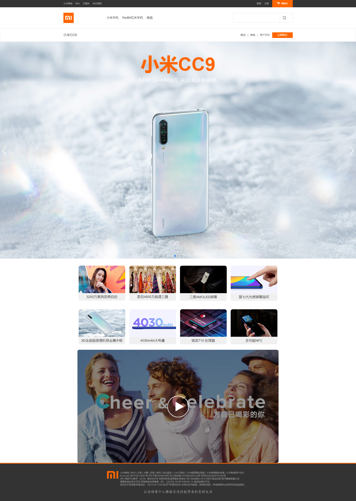
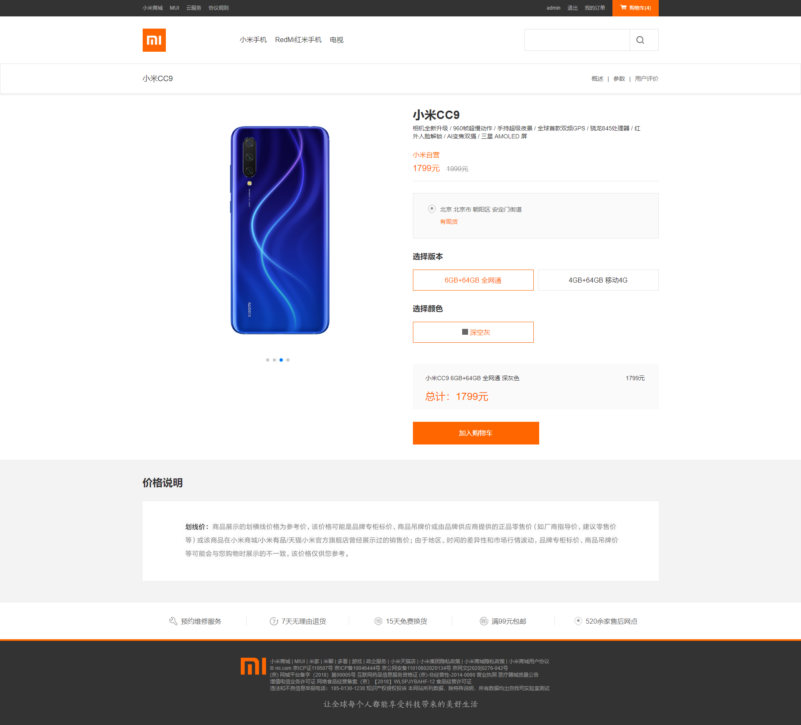
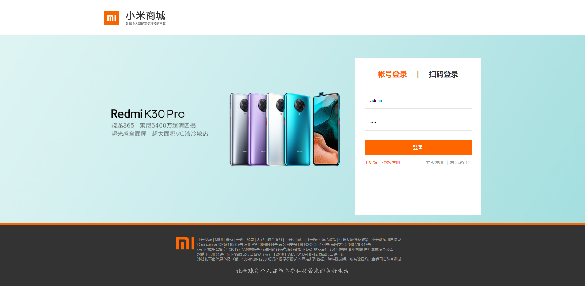

### Vue仿小米商城网站

- vue: 2.6.11
- vue-router: 3.1.5
- axios: 0.19.2
- vue-axios: 2.1.5
- element-ui: 2.13.0
- node-sass: 4.13.1
- sass-loader: 8.0.2
- vue-awesome-swiper: 3.1.3
- vue-cookie: 1.1.4
- vue-infinite-scroll: 2.0.2
- vue-lazyload: 1.3.3

目前只实现了 首页、商品详情页、商品购买页、购物车页面、订单页和登录页面

